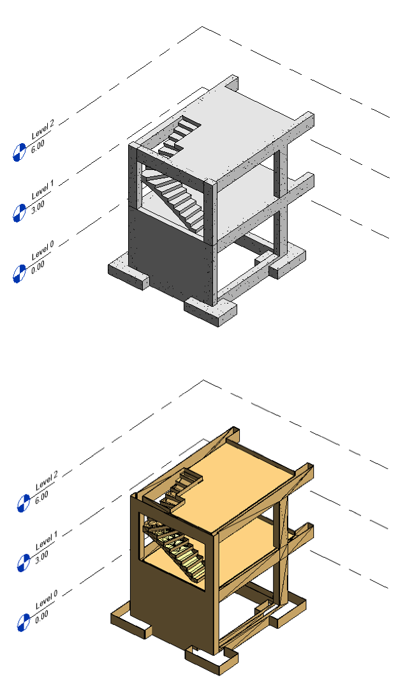

# Concrete Formwork Script

## Overview - Objective
This Dynamo script automates the creation of formwork elements in Revit. The script will generate the formwork for the entire concrete structure and calculate the total surface area of the formwork. This area measurement is crucial for determining the amount of material required.

## How to Use
1. Load your structural project in Revit.
2. Open Dynamo in Revit.
3. Load the `ConcreteFormwork_v1.0.dyn` script.
4. Adjust the foundation bottom elevation.
5. Run the script.
6. The formwork is created in Revit under category Generic Models and its total area is given in the node grouped under Formwork Area [m2].
   In Revit a Generic Models schedule may be prepared with the detailed list of Formwork elements' area and the total area.

## Requirements
- Dynamo version: [2.19.3]
- Revit version: [2024.2]

## Example

## Workflow

1. **Creating Formwork Material and Project Parameter:**
   - At the start of the script, a new material is created in the Revit project, named **"Wood - Formwork."** This material represents the physical formwork that will be used during the construction of the concrete structure.
   - Additionally, a project parameter called **"Formwork_Area"** is created. This parameter is specifically designated to store and calculate the surface area of the formwork for each structural element.

2. **Combining Element Solids:**
   - The script then collects all the solid geometries of the structural elements, such as slabs, beams, columns, walls, stairs, and foundations. Using a union operation, these solids are combined into a single, unified solid that represents the entire structure's formwork.

3. **Decomposing Surfaces:**
   - Once the unified solid is created, the script decomposes it into its constituent surfaces. This step is essential for calculating the surface area of each part of the formwork.

4. **Filtering by Vectors:**
   - The surfaces are then filtered based on their orientation using vector analysis. This step is crucial for excluding surfaces that do not require formwork. Specifically, horizontal and top surfaces, which are typically exposed and do not need formwork, are excluded from the calculation. Additionally, horizontal bottom surfaces of the foundation and elements that are directly on the ground are filtered out, as these surfaces also do not require formwork.

5. **Thickening and Area Assignment:**
   - After filtering, the relevant surfaces are thickened to represent the physical formwork. The script then assigns an area value to each of these surfaces using the **"Formwork_Area"** parameter, providing the total formwork area for the entire structure.

6. **Calculating Total Area:**
   - Finally, the script sums the area values of all thickened surfaces, giving you the total formwork surface area. This output can be used for material estimation, cost analysis, and construction planning.
